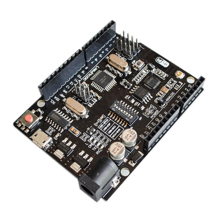

# ESP & Arduino Combi Board

I liked the idea of two controllers on one board. 

- The ESP8266 can manage WiFi, reading sensors, getting & sending data (non critical)
- The Arduino can control a safety critical hardware with a loop machine (critical)

#### Advantage:
If the ESP crashes or WiFi connection is lost. The controlled hardware will be in a safe state. When only ESP is used the whole thing can crash.

#### Tutorial:
I followed [this](https://www.hackster.io/umpheki/uno-r3-wifi-esp8266-ch340g-arduino-and-wifi-single-board-eed9f6) tutorial and modified it a bit. Instead of the Arduino controlling the ESP, the ESP is controlling the Arduino.

#### Hardware:
- The Arduino is connected on Pin 12 to a LED with resistor to ground
- The ESP is connected to a button on Pin 4 to 3,3 V (and a pull down resistor to ground) and a control LED on Pin 12 with a resistor to ground

#### Software:
I used PlatformIO with Visual Studio Code, a easy tutorial can be found [here](https://randomnerdtutorials.com/vs-code-platformio-ide-esp32-esp8266-arduino/).

- The source code can be found under ESP/src/main.cpp & Arduino/src/main.cpp
- The configuration for PlatformIO is called platformio.ini

#### Uploading:
When you want to upload the software to the chips follow [this](https://www.hackster.io/umpheki/uno-r3-wifi-esp8266-ch340g-arduino-and-wifi-single-board-eed9f6) guide on how to set the jumpers.

#### It works very well!
Board will therefore maybe used in my Master's Thesis